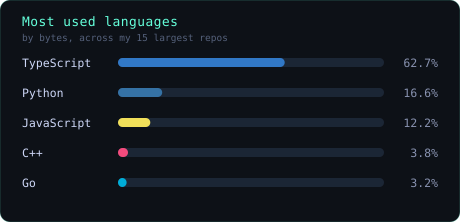

<div align="center">
  
</div>

<div align="center">

<a href="https://linkedin.com/in/imanmay2"></a>
<a href="mailto:imanmay2@gmail.com"></a>
<a href="https://github.com/imanmay2"></a>


<br/>


<a href="https://github.com/imanmay2?tab=followers"></a>

<br/><br/>


</div>

<br/>

---

## `$ whoami`



I'm a backend-heavy full-stack developer who'd rather design a system than clone a tutorial.

Most of my time goes into how data flows, where things break under load, and how services talk to each
other without turning into a mess. I work primarily in **Node.js** and **Go**, reach for **React/Next.js**
when the frontend actually needs me, and pull in **LangChain + FastAPI** when there's an AI problem worth solving.

The thing I care about most: what happens on the **unhappy path** — the dropped connection, the duplicate
write, the third pharmacist who clicked at the same moment.

<br clear="right"/>

```ts
const manmay = {
  focus:   ["backend systems", "real-time infra", "AI integration"],
  degree:  "B.Tech CSE (AI & ML) · VIT Chennai · 2028",
  now:     "NexCare — telemedicine with video consults + pharmacy workflows",
  reading: "distributed systems: consensus, replication, partition tolerance",
  open:    { role: "backend / AI internships", from: "May 2026" },
  belief:  "a well-designed API is better than a pretty UI",
} as const;
```

<sub>The portrait above is my actual photograph, not hand-drawn — luminance remapped through a levels
pass, background dropped with a feathered elliptical mask, then quantised onto a ten-character ramp.
Generator: <a href="assets/ascii_portrait.py">assets/ascii_portrait.py</a>.</sub>

---

## `$ ls ~/systems`

> Things I built to solve actual problems, not to pad a portfolio.

### ⬢ &nbsp;NexCare — Telemedicine Platform

     

Real-time video consultations, asynchronous prescription management, and a pharmacy workflow that tracks
medication from prescription through to dispensing.

<details>
<summary><b>Engineering notes</b></summary>

<br/>

```
  patient ──ws──┐                          ┌── signalling (SDP / ICE)
                ├─▶  gateway (Go)  ──┬──▶  │
  doctor  ──ws──┘        │           │     └── session store (Redis)
                         │           │
                         ▼           └──▶  prescription svc ──▶ Postgres
                   presence + reconnect                              │
                                                                     ▼
                                              pharmacy queue ── SELECT … FOR UPDATE
```

The problems that actually took thinking:

- **WebRTC signalling on bad networks** — ICE restarts and renegotiation so a consult survives a
  patient walking out of Wi-Fi range, instead of dropping the call.
- **Session state across disconnects** — presence and call state in Redis with TTLs, so a reconnect
  rejoins the same room rather than starting a ghost session.
- **The pharmacy race** — several pharmacists online, one prescription. Row-level locking so a
  medication can't be dispensed twice, and the queue stays consistent under concurrent claims.

</details>

**Status:** active development &nbsp;·&nbsp; [**Repo →**](https://github.com/imanmay2/NexCare)

<br/>

### ⬢ &nbsp;PharmaMind — AI Drug-Repurposing Research Tool

    

Built in 24 hours at a hackathon. An agentic system that takes a disease query, hits biomedical databases
(PubMed, ChEMBL), and surfaces drug-repurposing candidates with evidence summaries.

<details>
<summary><b>Engineering notes</b></summary>

<br/>

LangChain agents handle query decomposition and source aggregation; Plotly renders the compound
relationship graphs. The interesting part wasn't the prompting — it was **bounding the agent**:
capping tool-call depth, deduplicating overlapping literature hits, and keeping every claim traceable
back to a source so the output is auditable rather than plausible-sounding.

This was the project that made me take LLM tool-use seriously.

</details>

**Status:** hackathon build &nbsp;·&nbsp; [**Repo →**](https://github.com/imanmay2/PharmaMind)

<br/>

### ⬢ &nbsp;QNeX — Quiz Platform with Shareable Test IDs

    

Create a test, share one ID, and everyone with the link takes the same instance. Cohere generates the
questions from a topic + difficulty input.

<details>
<summary><b>Engineering notes</b></summary>

<br/>

Real analytics rather than a final score: per-user results, question-level accuracy, and time-per-question.
The interesting part was the **schema** — modelling attempts as references into a single immutable question
set, so thousands of attempts don't duplicate question data and an edit to a test never silently rewrites
history for people who already took it.

</details>

**Status:** complete &nbsp;·&nbsp; [**Repo →**](https://github.com/imanmay2/QNeX)

<br/>

### ⬢ &nbsp;WanderLust — Listings & Booking Platform

    

Yes, it's an Airbnb-style app — the idea was never the point. Geospatial queries, RESTful resource design,
and auth flows (session vs. token, CSRF handling) were. Radius-based listing search via Mapbox was the
non-tutorial part.

**Status:** complete &nbsp;·&nbsp; [**Repo →**](https://github.com/imanmay2/wander_lust)

---

## `$ cat stack.toml`

<div align="center">
  
</div>

<br/>

| | |
|:--|:--|
| **Backend** | `Go (Gin)` · `Node.js` · `Express` · `FastAPI` · `WebSockets` · `WebRTC` · `REST` · `gRPC` *(learning)* |
| **Frontend** | `React` · `Next.js` · `TypeScript` · `Tailwind CSS` |
| **Data** | `PostgreSQL` · `MongoDB` · `Redis` · `Supabase` · `MySQL` |
| **Infra** | `Docker` · `GitHub Actions` · `Linux` |
| **AI** | `LangChain` · `Cohere` · `FastAPI` · `Python` |
| **Languages** | `Go` · `TypeScript` · `JavaScript` · `Python` · `Java` · `C++` |

---

## `$ git log --author="manmay"`

**Software Engineer Intern** — *Cestrum Technologies* &nbsp;<sub>`Nov 2025 → Feb 2026`</sub>
> Built the WebSocket backend for real-time communication: connection lifecycle management, message
> broadcasting across concurrent sessions, server-side event processing. First time I had to care what
> happens at 500 simultaneous connections, not 5.

**Web Development Lead** — *CodeChef VIT Chennai* &nbsp;<sub>`Jul 2025 → present`</sub>
> Led backend for the SIH 2025 team project in Go + Next.js + MongoDB. Mentored juniors on API design
> and schema decisions — mostly on why the boring choice is usually right.

**Technical Team** — *E-Cell VIT Chennai* &nbsp;<sub>`Aug 2025 → Apr 2026`</sub>
> Built a real-time Stock Market Simulator: live price indicators, interactive trading UI, event-state
> synchronisation across clients.

---

## `$ top -o commits`

<div align="center">

<picture>
  <source media="(prefers-color-scheme: dark)" srcset="https://streak-stats.demolab.com?user=imanmay2&hide_border=true&background=0d1117&stroke=64ffda&ring=64ffda&fire=ff6b6b&currStreakLabel=64ffda&sideLabels=8892b0&dates=8892b0&currStreakNum=ccd6f6&sideNums=ccd6f6"/>
  
</picture>


</div>

<div align="center">
  <picture>
    <source media="(prefers-color-scheme: dark)" srcset="https://raw.githubusercontent.com/imanmay2/imanmay2/output/snake-dark.svg"/>
    
  </picture>
</div>

---

## `$ mail -s "hello"`

If you're building something in **backend infrastructure, real-time systems, or AI tooling** — and you want
someone who'll go figure it out rather than wait to be told what to do — I'd like to hear about it.

<div align="center">

<br/>

<a href="mailto:imanmay2@gmail.com"></a>
<a href="https://linkedin.com/in/imanmay2"></a>

<br/><br/>

<sub><i>Available from May 2026 · open to relocation</i></sub>

</div>


